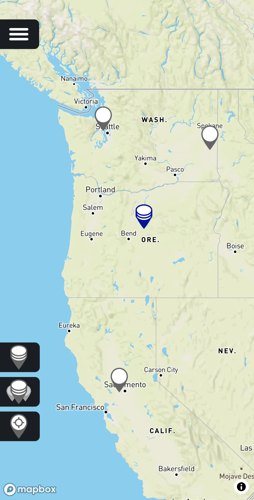

# Average Location Finder

Drop pins on a map and find the geographic midpoint of all of them.

**Live app:** [averagelocation.com](https://www.averagelocation.com)



## Background

As my family moved apart to different locations we often discussed our "average family location", the average point geographically from all our locations. We manually calculated the point a couple of times but I eventually was inspired to create a web tool to make this task easier. So on a gray and rainy weekend I put together Average Location Finder (ALF).

## Features

- Tap or click the map to place any number of pins
- The midpoint updates instantly as you add, move, or remove pins
- Responsive layout that works on every device

## Tech stack

- [SvelteKit](https://svelte.dev/docs/kit/introduction)
- [MapBox](https://www.mapbox.com)
- Cloudflare [workers](https://www.cloudflare.com/products/workers) and [pages](https://www.cloudflare.com/products/pages)

## Running locally

Requires [Node.js](https://nodejs.org) and [pnpm](https://pnpm.io).

```bash
pnpm install
pnpm run dev

# or start the server and open the app in a new browser tab
pnpm run dev -- --open
```

## Building

```bash
pnpm run build
pnpm run preview   # preview the production build locally
```
